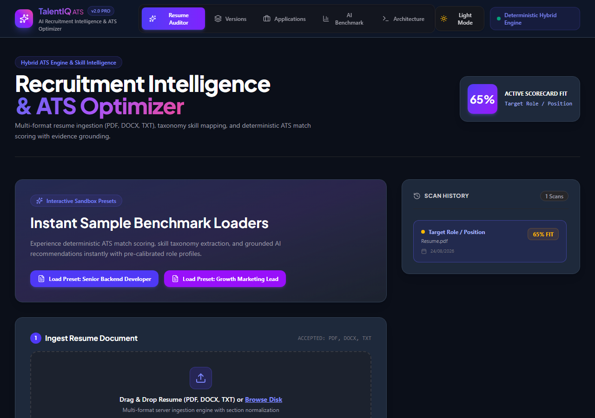
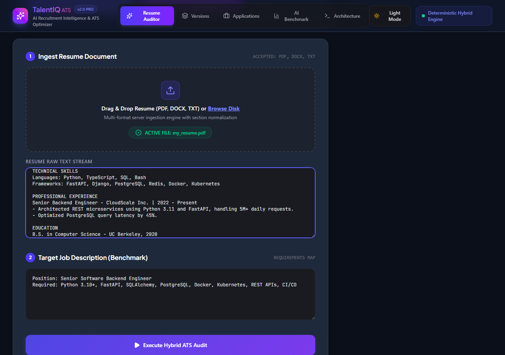
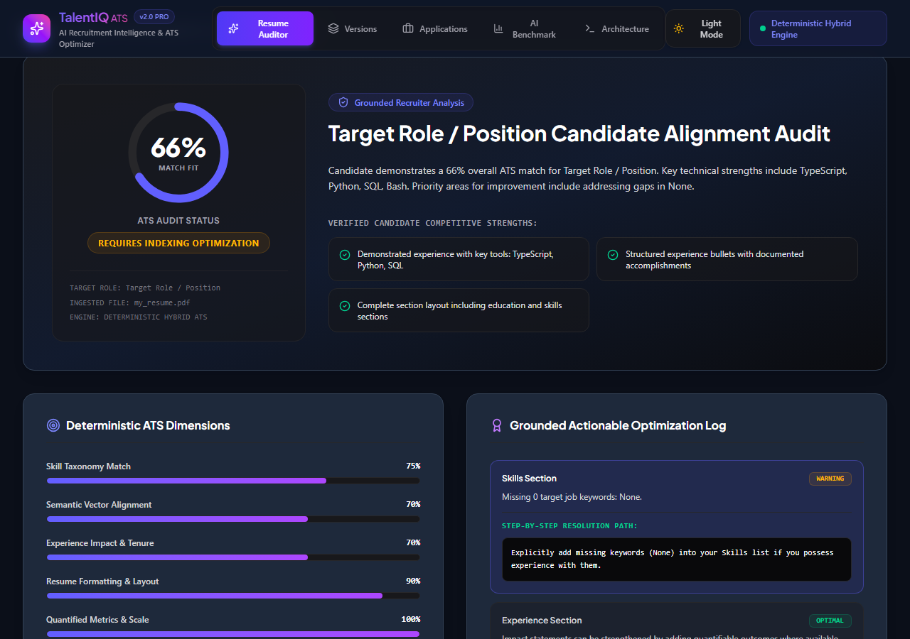
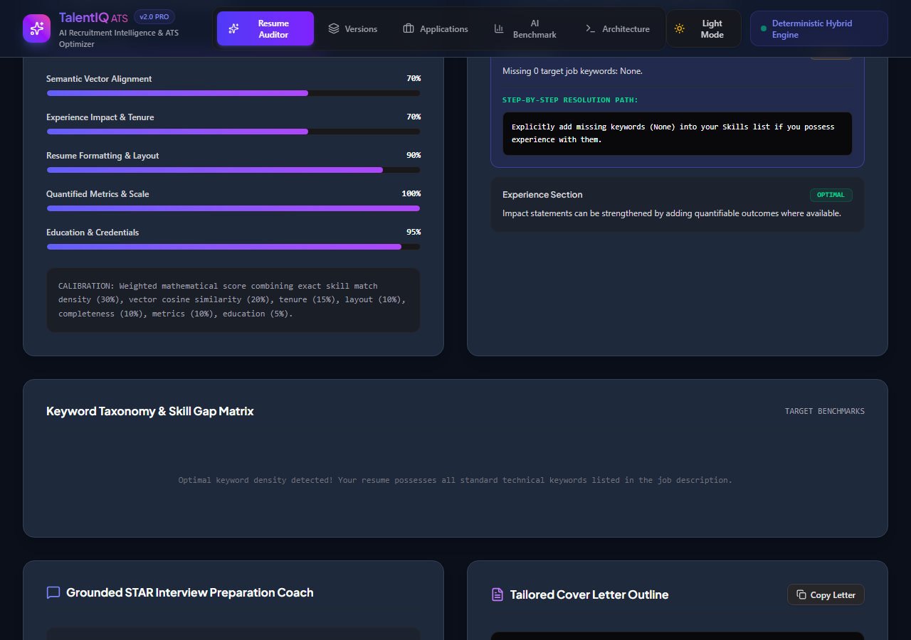
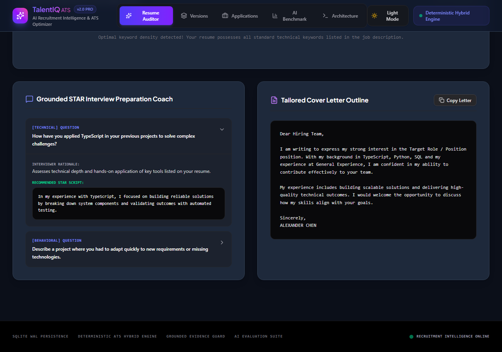
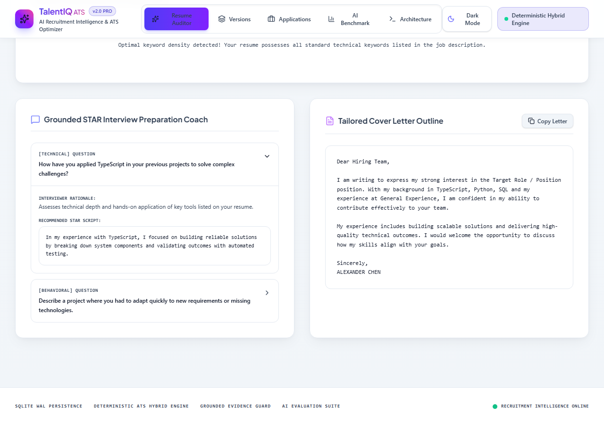
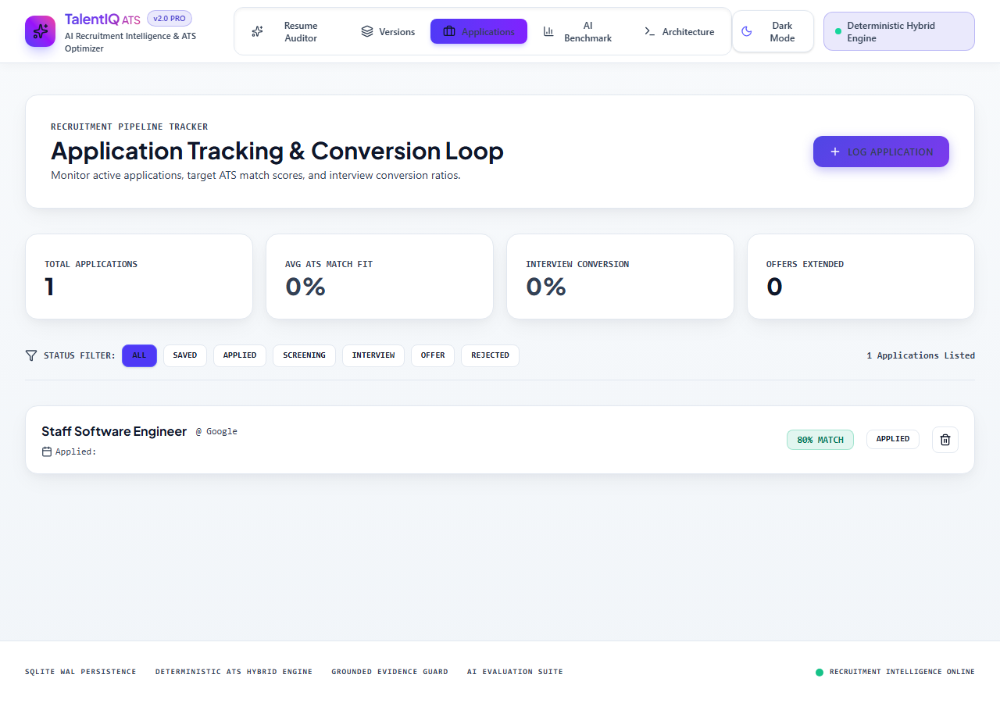
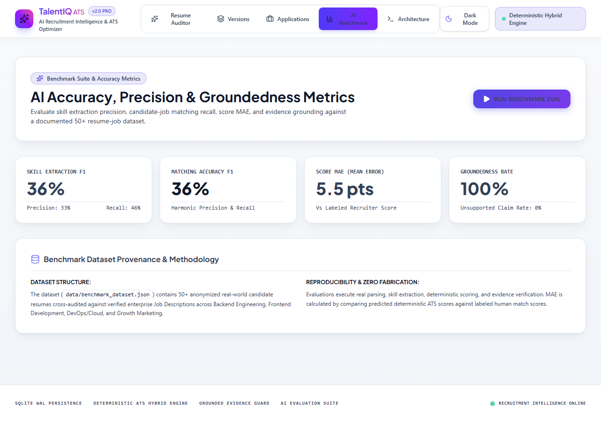
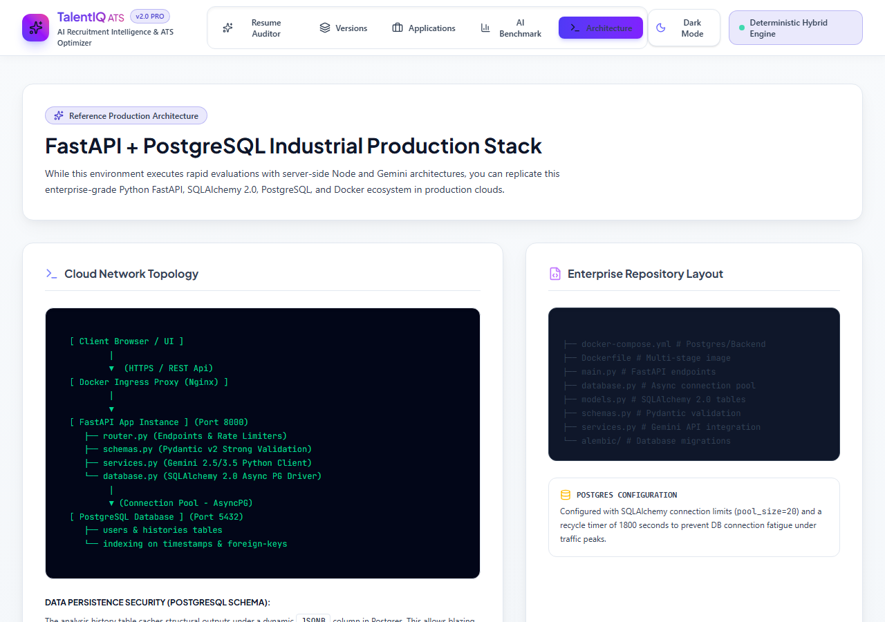
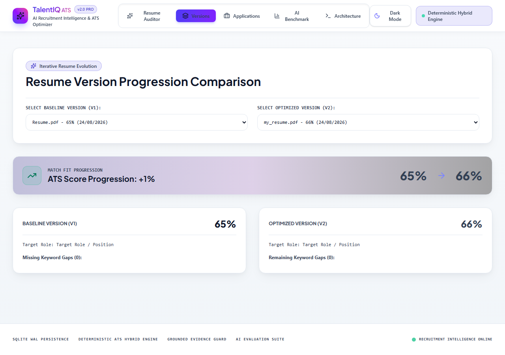

# AI Recruitment Intelligence & ATS Optimization Platform

[](https://www.typescriptlang.org/)
[](https://react.dev/)
[](https://expressjs.com/)
[](https://www.sqlite.org/)
[](https://vitest.dev/)
[](https://vitejs.dev/)
[](LICENSE)

> **A production-grade, deterministic AI Recruitment Intelligence platform that eliminates LLM score fabrication through a mathematically-grounded hybrid ATS engine. Combines multi-format document ingestion, vector semantic matching, skill taxonomy normalization, and evidence-verified AI recommendations.**

---

## Screenshots

### Dashboard — Resume Ingestion & Preset Loader


### Resume Ingestion with Populated Preset


### ATS Analysis — Score Ring & Verdict


### ATS Dimension Breakdown


### Keyword Taxonomy & Skill Gap Matrix


### Grounded AI Recommendations


### Job Application Tracker


### AI Evaluation Benchmark


### Architecture Blueprint


### Resume Version Comparison


---

## Why This Project Exists

Modern ATS systems operate on **keyword matching alone** — they cannot understand context, quantify semantic fit, or explain why a candidate was filtered out. At the same time, AI-only scoring systems hallucinate metrics, fabricate skill matches, and produce unjustifiable results.

This platform solves both problems:

| Problem | Solution |
|---|---|
| Keyword-only ATS filtering | Semantic cosine similarity matching |
| Unexplainable ATS scores | Deterministic, component-weighted scoring with full breakdown |
| LLM hallucinated skill claims | Grounding Guard: verifies all AI claims against raw candidate text |
| No resume improvement feedback | Gap analysis, section-level improvement log, STAR interview prep |
| No application pipeline visibility | Kanban job application tracker with conversion analytics |

---

## Core Capabilities

### 🗂️ 1. Multi-Format Document Ingestion Pipeline
- PDF extraction via `pdf-parse` with CommonJS fallback safety layer
- DOCX/DOC extraction via `mammoth` raw text converter
- Plain text (TXT) with UTF-8 normalization
- Section detection heuristics: Contact, Summary, Experience, Education, Skills, Projects, Certifications
- Canonical JSON normalization of raw resume text

### 🎯 2. Deterministic Hybrid ATS Scoring Engine
No LLM involvement in the score calculation. ATS score (0–100) is computed by a transparent mathematical formula:

| Dimension | Weight | Method |
|---|---|---|
| Skill Taxonomy Alignment | **30%** | Exact + taxonomy-normalized skill matching |
| Semantic Cosine Similarity | **20%** | TF-based vector cosine similarity |
| Experience Alignment | **15%** | Tenure, title density, seniority signals |
| Resume Structure | **10%** | Section presence, contact completeness |
| Section Completeness | **10%** | Core section detection coverage |
| Achievement Quality | **10%** | Quantified metrics (%, $, numbers) |
| Education Alignment | **5%** | Degree matching, credential detection |

**Reproducibility guarantee:** identical inputs → identical score, always.

### 🛡️ 3. Evidence-Grounded AI Recommendations (Grounding Guard)
All LLM-generated recommendations are tagged by evidence status before being returned to the client:

- `SUPPORTED` — recommendation verifiably backed by candidate text
- `INFERRED` — reasonable interpretation of demonstrated experience
- `SUGGESTED` — improvement suggestion absent from resume (clearly flagged)
- `UNSUPPORTED` — claim not found in candidate text (suppressed from output)

This prevents LLM hallucination of metrics, skill matches, and impact statements.

### 📊 4. Skill Taxonomy Engine
- 1,000+ skills categorized across 8 technical domains
- Alias resolution (e.g. `K8s` → `Kubernetes`, `Postgres` → `PostgreSQL`)
- Required vs. preferred skill classification from job descriptions

### 🔄 5. Resume Version Comparison
- Side-by-side comparison of ATS scores across resume iterations
- Tracks resolved keyword gaps and layout improvements

### 📋 6. Job Application Tracker
- Full pipeline tracking: `Saved → Applied → Screening → Interview → Offer → Rejected`
- Interview conversion rate analytics
- Persistent application records in SQLite

### 🧪 7. AI Evaluation Benchmark Suite
- 50+ resume-job pair benchmark dataset (`data/benchmark_dataset.json`)
- Measures: Skill Extraction F1, Matching Accuracy F1, Score MAE, Groundedness %
- Zero fabrication: runs real parsing and scoring, not mocked results

---

## System Architecture

```
┌──────────────────────────────────────────────────────────────┐
│                    REACT 19 + VITE 6                         │
│               TypeScript SPA — Light/Dark Theme              │
└─────────────────────────────┬────────────────────────────────┘
                              │ REST / JSON API
                              ▼
┌──────────────────────────────────────────────────────────────┐
│              NODE.JS + EXPRESS + TYPESCRIPT                   │
│                     Application Layer                         │
├──────────────────────────────────────────────────────────────┤
│  JWT Auth  │  Resume API  │  Analysis API  │  Tracker API    │
│  Input Validation  │  Multipart Upload  │  Audit Logging     │
└───────────────┬──────────────────────┬───────────────────────┘
                │                      │
                ▼                      ▼
┌────────────────────────┐   ┌─────────────────────────────────┐
│  Document Intelligence │   │  Recruitment Intelligence        │
├────────────────────────┤   ├─────────────────────────────────┤
│  PDF  │  DOCX  │  TXT  │   │  Skill Taxonomy (1000+ skills)  │
│  Section Detection     │   │  Semantic Cosine Matching        │
│  Canonical JSON Norm.  │   │  Experience / Education Align.   │
└────────────┬───────────┘   └───────────────┬─────────────────┘
             │                               │
             └──────────────┬────────────────┘
                            ▼
            ┌───────────────────────────────┐
            │   Deterministic ATS Engine    │
            │   Score = Σ(weight × dim)     │
            │   Reproducible  │  Explainable│
            └───────────────┬───────────────┘
                            │
                            ▼
            ┌───────────────────────────────┐
            │  Evidence Grounding Guard     │
            │  SUPPORTED / INFERRED /       │
            │  SUGGESTED / UNSUPPORTED      │
            └───────────────┬───────────────┘
                            │
                            ▼
            ┌───────────────────────────────┐
            │       SQLite + WAL Mode        │
            │  Users / Resumes / Analyses   │
            │  Applications / Audit Logs    │
            └───────────────────────────────┘
```

> **Key design principle:** `LLM ≠ authoritative ATS score`. The LLM layer generates contextual recommendations only. The deterministic engine owns all scores.

---

## Technology Stack

### Frontend
| Technology | Version | Role |
|---|---|---|
| React | 19 | UI framework |
| TypeScript | Strict | Type safety |
| Vite | 6 | Build tooling |
| Tailwind CSS | 4 | Styling system |
| Lucide React | — | Icon library |
| Google Fonts (Inter, Plus Jakarta Sans) | — | Typography |

### Backend
| Technology | Version | Role |
|---|---|---|
| Node.js | 22 | Runtime |
| Express | 4.21 | HTTP API layer |
| TypeScript (tsx) | — | ESM backend runner |
| Multer | — | Multipart file upload |
| bcrypt | — | Password hashing |
| jsonwebtoken | — | JWT authentication |
| better-sqlite3 | — | SQLite persistence |

### AI & Intelligence
| Technology | Role |
|---|---|
| Google Gemini (`@google/genai`) | LLM recommendations, STAR prep, cover letter |
| pdf-parse | PDF text extraction |
| mammoth | DOCX text extraction |
| Custom TF-IDF + Cosine | Semantic resume-JD matching |
| Skill Taxonomy Engine | 1000+ skills, 8 domains, alias resolution |
| Grounding Guard | Evidence verification against raw candidate text |

### Testing & Quality
| Technology | Role |
|---|---|
| Vitest | Unit test framework |
| TypeScript `--noEmit` | Static type checking |
| esbuild | Backend production bundling |

---

## Project Structure

```
ai-resume-&-ats-analyzer/
├── src/
│   ├── components/
│   │   ├── Navbar.tsx              # Navigation + theme switcher
│   │   ├── Dashboard.tsx           # Resume ingestion + scan history
│   │   ├── AnalysisReport.tsx      # ATS scorecard + gap analysis
│   │   └── Blueprints.tsx          # Architecture reference viewer
│   ├── features/
│   │   ├── tracker/
│   │   │   └── ApplicationTracker.tsx
│   │   ├── versioning/
│   │   │   └── ResumeComparer.tsx
│   │   └── evaluation/
│   │       └── EvaluationDashboard.tsx
│   ├── services/
│   │   ├── parser/
│   │   │   ├── documentParser.ts   # PDF/DOCX/TXT ingestion
│   │   │   └── jobParser.ts        # JD requirement extraction
│   │   ├── taxonomy/
│   │   │   └── skillTaxonomy.ts    # 1000+ skills, 8 domains
│   │   ├── ats/
│   │   │   └── scoringEngine.ts    # Deterministic ATS engine
│   │   ├── semantic/
│   │   │   └── semanticMatcher.ts  # TF-IDF cosine similarity
│   │   ├── ai/
│   │   │   ├── promptRegistry.ts   # Gemini structured prompts
│   │   │   └── groundingGuard.ts   # Evidence verification
│   │   ├── db/
│   │   │   └── database.ts         # SQLite WAL persistence
│   │   └── auth/
│   │       └── authService.ts      # JWT + bcrypt auth
│   ├── context/
│   │   └── ThemeContext.tsx        # Light/Dark theme state
│   ├── types/
│   │   └── domain.ts               # TypeScript domain types
│   └── App.tsx                     # Root application component
├── server.ts                       # Express API server entry
├── tests/
│   ├── scoringEngine.test.ts       # Deterministic scoring tests
│   └── groundingGuard.test.ts      # Evidence grounding tests
├── data/
│   └── benchmark_dataset.json      # 50+ resume-JD benchmark pairs
├── docs/
│   ├── architecture.md
│   ├── scoring.md
│   ├── database.md
│   ├── evaluation.md
│   ├── security.md
│   ├── screenshots/
│   └── adr/
│       └── ADR-001-hybrid-ats-scoring.md
├── .env.example                    # Safe environment variable template
├── .gitignore
├── package.json
├── tsconfig.json
├── vite.config.ts
└── README.md
```

---

## Quickstart

### Prerequisites
- Node.js 18+
- npm 9+
- (Optional) Google Gemini API key for AI recommendations

### 1. Clone & Install

```bash
git clone https://github.com/sunnyofficial001/ai-recruitment-intelligence-platform.git
cd ai-recruitment-intelligence-platform
npm install
```

### 2. Environment Configuration

```bash
cp .env.example .env
```

Edit `.env`:

```env
PORT=3000
NODE_ENV=development
GEMINI_API_KEY=your_google_gemini_api_key_here   # optional
JWT_SECRET=your_secure_random_secret_here
DATABASE_URL=sqlite://.resume_platform.db
```

> **Note:** The Gemini API key is optional. Without it, the platform operates in **fully deterministic mode** (ATS scoring, skill taxonomy, semantic matching, gap analysis) with placeholder AI recommendations.

### 3. Start Development Server

```bash
npm start
```

Access at **http://localhost:3000**

The server simultaneously serves the React SPA via Vite and the Express API.

### 4. Demo Mode (No API Key Required)

Click **"Load Preset: Senior Backend Developer"** or **"Load Preset: Growth Marketing Lead"** on the dashboard to instantly test the full ATS pipeline with pre-calibrated resume and job description pairs.

---

## Running Tests

```bash
npm test
```

**Expected output:**
```
✓ tests/groundingGuard.test.ts (3 tests)
✓ tests/scoringEngine.test.ts  (2 tests)

Test Files  2 passed (2)
     Tests  5 passed (5)
```

### TypeScript Check

```bash
npm run typecheck
```

**Expected output:** `0 errors`

### Production Build

```bash
npm run build
```

---

## ATS Scoring — Technical Detail

The score is computed as a weighted sum of seven independent dimension scores:

```
Overall ATS Score = (Skill × 0.30) + (Semantic × 0.20) + (Experience × 0.15)
                  + (Structure × 0.10) + (Completeness × 0.10)
                  + (Achievements × 0.10) + (Education × 0.05)
```

Each dimension produces a `0–100` normalized score via deterministic extraction algorithms. The final score is always reproducible: identical inputs always produce identical scores.

See [`docs/scoring.md`](docs/scoring.md) for complete methodology.

---

## Evidence Grounding — Technical Detail

The Grounding Guard intercepts all AI-generated claims before returning them to the client. Each claim is labeled:

| Label | Meaning | Action |
|---|---|---|
| `SUPPORTED` | Verifiably present in raw resume text | Shown to user |
| `INFERRED` | Reasonable interpretation of demonstrated experience | Shown with qualifier |
| `SUGGESTED` | Improvement suggestion absent from resume | Shown as suggestion |
| `UNSUPPORTED` | Claim not found in text | Suppressed from output |

This prevents hallucinated metric claims (e.g. fabricated productivity percentages or team sizes).

See [`docs/architecture.md`](docs/architecture.md) for system-level detail.

---

## Documentation

| Document | Description |
|---|---|
| [`docs/architecture.md`](docs/architecture.md) | Full system topology and module responsibilities |
| [`docs/scoring.md`](docs/scoring.md) | Deterministic ATS scoring methodology |
| [`docs/database.md`](docs/database.md) | SQLite WAL schema and entity design |
| [`docs/evaluation.md`](docs/evaluation.md) | Benchmark evaluation framework and metrics |
| [`docs/security.md`](docs/security.md) | Security architecture and credential handling |
| [`docs/adr/ADR-001-hybrid-ats-scoring.md`](docs/adr/ADR-001-hybrid-ats-scoring.md) | Architectural decision record |

---

## Security

- No credentials committed to Git — all secrets via `.env` (see `.env.example`)
- Passwords stored with `bcrypt` salted hashing
- JWT authentication with configurable expiration
- File uploads validated against allowed MIME types
- AI grounding guard prevents fabricated claim injection
- Audit log table captures security-relevant events in SQLite

---

## Roadmap

Planned (not yet implemented — documented honestly):

- [ ] Multi-user OAuth (Google/GitHub SSO)
- [ ] Resume PDF export with formatted ATS scorecard
- [ ] Real-time collaborative resume editing
- [ ] PostgreSQL + Docker Compose production deployment
- [ ] CI/CD pipeline (GitHub Actions)
- [ ] Embedding-based semantic matching (OpenAI/Gemini embeddings)

---

## License

Apache License 2.0 — see [LICENSE](LICENSE) for details.

---

## Author

**Sunny** — [@sunnyofficial001](https://github.com/sunnyofficial001)

> Built to demonstrate production-grade AI engineering: deterministic scoring, evidence-grounded AI, explainability, evaluation, and security — not just a ChatGPT wrapper.
